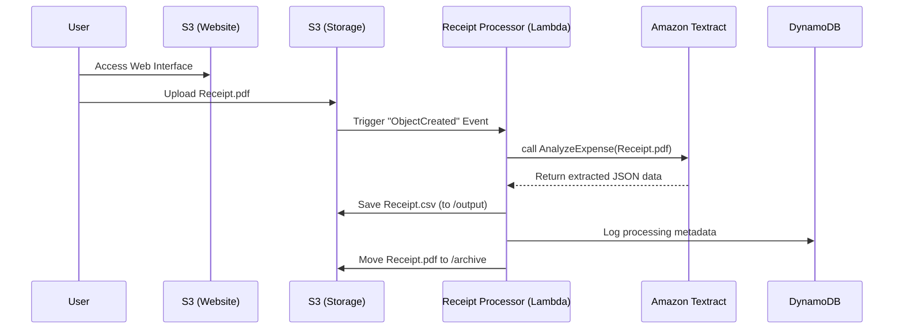

# Automated Receipt Processor - Project Documentation

## 1. Executive Summary

The **Automated Receipt Processor** is a cloud-native, serverless application designed to digitize the financial tracking process. By uploading a receipt (PDF) to a web interface, the system automatically uses Machine Learning (Amazon Textract) to extract key financial data—such as Vendor Name, Date, and Total Amount—and converts it into a structured CSV format.

This project serves as a reference architecture for building **Event-Driven AI Pipelines** on AWS using Infrastructure as Code (CDK).

---

## 2. Architecture

The system follows a completely serverless "Event-Driven" architecture. This means there are no servers running 24/7; costs are incurred only when a document is processed.

---

## 3. Workflow Description

1.  **Ingestion**: A user accesses the static website hosted on **Amazon S3**. They upload a PDF using temporary, secure guest credentials provided by **Amazon Cognito**.
2.  **Trigger**: The file landing in the `uploads/` folder of the S3 Bucket automatically triggers an **AWS Lambda** function.
3.  **Analysis**: The Lambda function sends the document to **Amazon Textract**, a Machine Learning service optimized for financial documents (`AnalyzeExpense` API).
4.  **Extraction**: Textract identifies key fields (Vendor, Total, Date) regardless of the receipt's layout.
5.  **Transformation**: The Lambda function parses the raw ML output and formats it into a standard Comma-Separated Values (CSV) string.
6.  **Storage & Archival**:
    *   The CSV is saved to the `output/` folder in S3.
    *   The original PDF is moved to the `archive/` folder to keep the workspace clean.
    *   Metadata (status, original filename) is logged to **Amazon DynamoDB** for auditability.

---

## 4. Technical Components

### A. Infrastructure as Code (AWS CDK)
The entire infrastructure is defined in Python using the AWS Cloud Development Kit (CDK). This ensures the environment is reproducible and version-controlled.
*   **File**: `cdk/receipt_processor.py`
*   **Key Resources**:
    *   `s3.Bucket`: Configured with CORS for web access and Event Notifications for Lambda.
    *   `lambda.Function`: Python 3.9 runtime, given read/write permissions to S3 and access to Textract.
    *   `cognito.CfnIdentityPool`: Allows unauthenticated "guest" users to upload files securely without creating an account.

### B. The Backend (AWS Lambda)
The core logic resides in a simple Python script.
*   **File**: `lambda/csv_processor/main.py`
*   **Logic**:
    *   `lambda_handler`: The entry point. It receives the S3 Event object.
    *   `process_receipt`: Orchestrates the flow (Textract -> Extract -> Save -> Archive).
    *   `extract_csv_data`: Parsers the complex JSON response from Textract into simple rows.

### C. The Frontend (Static Web)
A lightweight HTML/JS interface that runs directly in the browser.
*   **File**: `web/index.html`
*   **Features**:
    *   Uses `AWS SDK for JavaScript` to communicate directly with S3.
    *   Polls the S3 bucket's `output/` folder to display processed results.
    *   Zero backend servers required for the UI (hosted entirely on S3).

---

## 5. Key AWS Services

| Service | Role | Why we use it |
| :--- | :--- | :--- |
| **Amazon S3** | Storage | Durable, cheap storage for files and hosting the website. |
| **AWS Lambda** | Compute | Runs code in response to events (uploads) without managing servers. |
| **Amazon Textract** | AI/ML | specialized OCR that understands receipts (knows that "Total" is a price, not just a word). |
| **Amazon DynamoDB** | Database | Fast NoSQL database to keep a log of every processed receipt. |
| **Amazon Cognito** | Security | Grants temporary, limited permission to website visitors so they can upload files. |

---

## 6. Data Schema

The system extracts the following fields for every receipt:

*   **Vendor**: The merchant name (e.g., "Starbucks", "Uber").
*   **Invoice/Receipt Date**: The transaction date.
*   **Total**: The final amount charged.
*   **Invoice Number**: The unique identifier found on the receipt (if any).

---

## 7. Future Enhancements

Potential improvements for student projects:

*   **User Authentication**: Replace "Guest" access with real Sign-Up/Sign-In using Cognito User Pools.
*   **Email Notifications**: Use Amazon SNS to email the user when the CSV is ready.
*   **Analytics**: Hook up Amazon QuickSight to visualize spending trends based on the generated CSVs.
